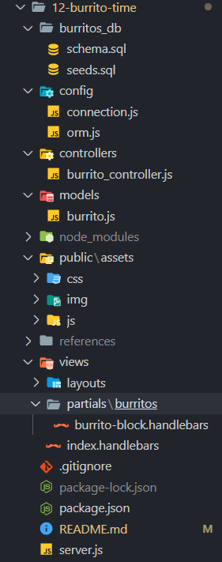

# Burrito Time

This application represents my first project in putting the full stack of web technologies together. The application will display burrito objects whose location depends on the state of a boolean variable. Burritos that are ready to eat will appear on the left-hand side of the page while burritos that have consumed will appear on the right-hand side. Since this is burrito paradise burritos can be moved from either column by pressing the associated button. It is also possible create your own burrito and choose which group to add it to. 


## Table of Contents

| |||
|:-|:-|:-|
| [Project Introduction](#burrito-time) | [Table of Contents](#table-of-contents) | [Goals and Methods](#goals-and-methods) 
| [Deployed Link](#deployed-link) | [Technologies](#technologies) | [Author](#author) 
| [Acknowledgments](#acknowledgments) | [License](#license) |
---

## Goals and Methods

The primary motivation for this project was the following learning goals:
* Organize a full stack web application using Model View Control (MVC) design,
* Use Express-Handlebars as a precursor to learning React, and
* Learn to deploy a full stack application to Heroku that has a database.

The top level goal of this project was to learn to modularize and organize the codebase following MVC. Splitting the codebase in this manner makes managing it easier as the project grows in scale. The first step was to create the file structure:



Model is the part of the codebase were I was able to establish how the data would be built inside the database, as well as functions to query it. The model segment is contained within these folders:
* burritos_db,
* config
* models

Control is the part of the codebase where requests to the server for a resource will be routed effectively. This segment sits between the model and view components. As an application grows so do the number of routes. Organizing the routes using MVC makes it possible to effectively manage the number of routes. Control files were stored inside the following directories:
* controllers
* public -> js

The javascript file stored under the public folder is the client side code that originates the AJAX requests for information. This can be thought of as the interface between the control and view segments as that javascript file also dictates how information is displayed. This leads us to the views segment of the codebase which is where we dictate what the application will look like. Express-Handlebars was employed to dynamically build HTML. Also Express-Handlebars was included as part of this project as a means of taking a step towards learning how to use a frontend framework like React. The location that a burrito will be displayed in depends on the state of database column value named 'devoured'. The Handlebars code that made this possible:
```handlebars
<ul class="menu">
	{{#each burritos}}
	{{#if devoured}}
	{{> burritos/burrito-block devour=false}}
	{{/if}}
	{{/each}}
</ul>
```
The partial that is called inside the above Handlebars also contained dynamic element construction dependant on the value of devoured:
```handlebars
<li>{{burrito_name}}
	<button class="button primary change-devour" data-id="{{id}}" data-newdevour="{{devour}}">
		{{#if devour}}EAT IT!{{else}}SAVE IT!{{/if}}
	</button>
</li>
```


Adding the application to Heroku was not as daunting as I was originally anticipating. The following steps were taken:

1) Create a new Heroku application while inside the project directory that contains the .git files. Use 'heroku create -a YOUR APP NAME.
2) Go to the [Heroku Dashboard](https://dashboard.heroku.com/apps) and click on the application you just created.
3) Click 'Resources' in the navigation ribbon.
4) I used MySQL for this project so I searched MySQL in the 'Add-ons'. 
5) Select JawsDB MySQL and ensure you are using the 'Kitefin Shared' version as it is free. You will have to add credit card information to your accout to complete this step.
6) Once JawsDB is added you can click on the link inside the application Resources page to view the connection information. In order to initialize the database and perfom tests it was nessicary to enter the server connection information into MySQL workbench. The connection.js file that is in charge of connecting to the database also needed to be equipped with the ability to choose between the databases:
```javascript
if(process.env.JAWSDB_URL) {
  connection = mysql.createConnection(process.env.JAWSDB_URL);
} else {
  connection = mysql.createConnection({
			host: "localhost",
			...
```
7) Git add, commit, and push the project to the Heroku remote. Done!


## Deployed Link

[Deployed to Heroku](https://burritozilla.herokuapp.com/)

## Technologies 

| |||
|:-|:-|:-|
| [HTML](https://developer.mozilla.org/en-US/docs/Web/HTML) | [CSS](https://developer.mozilla.org/en-US/docs/Web/CSS) | [Javascript](https://developer.mozilla.org/en-US/docs/Web/JavaScript) |
| [Node.js](https://nodejs.org/en/) | [Express](https://expressjs.com/) | [Express Handlebars](https://www.npmjs.com/package/express-handlebars) |
| [MySQL Database](https://www.mysql.com/) | [MySQL Node.js](https://www.npmjs.com/package/mysql) | [Foundation 6](https://get.foundation/)

## Author

Coleman Buffa

* [Git Hub](https://github.com/coleman-buffa/burrito-time)
* [My Portfolio](https://coleman-buffa.github.io/portfolioV2/)
* [LinkedIn](https://www.linkedin.com/in/coleman-buffa/)

## Acknowledgments

My thanks to the many mentors and friends who are a constant source of project ideas, learning topics, and guidance.

After deployment I passed the link around to friends and one of them added the crown jewel, "Super Carnitas burrito extra cheese con todo, yes". Thank you Rory.

## License

[](https://opensource.org/licenses/MIT)

### [Back to Table of Contents](#table-of-contents)